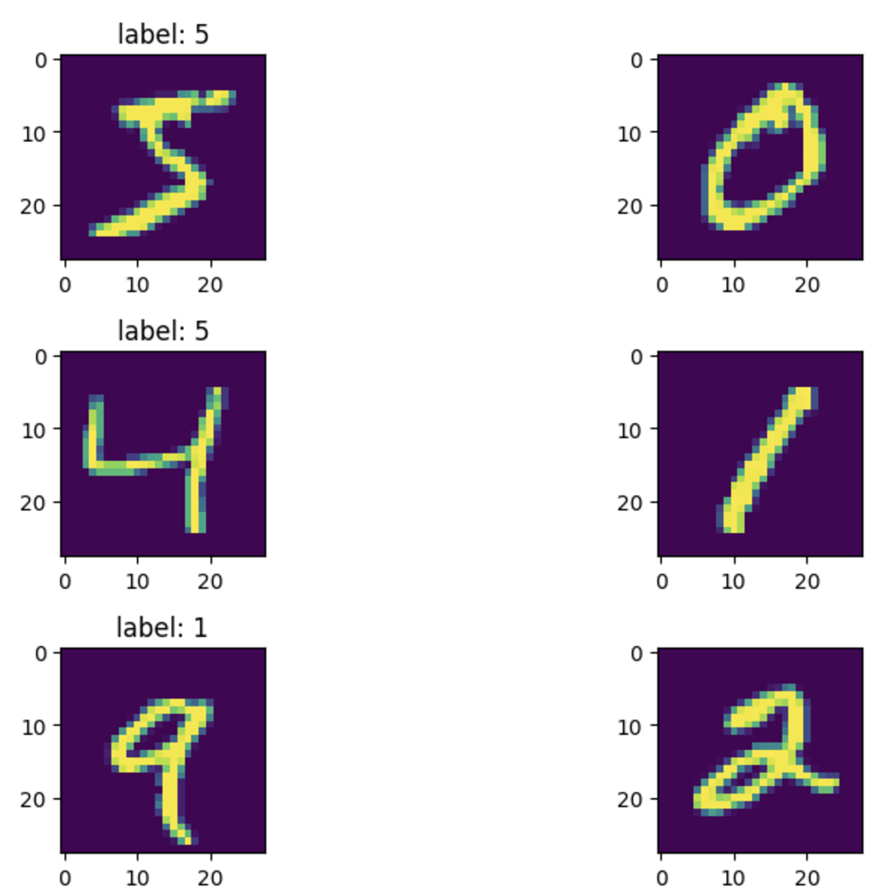

## PyTorch CNN-LSTM sample

A sample task using CNN-LSTM model

### Task

- Take 2 consecutive digits images
- Predict last digit in sum of 2 digits
    - example1: 9 + 2 = 1
    - example2: 3 + 9 = 2

### Sample data

### Notebook

[predict_mnist_2consecutive_digits_sum.ipynb](predict_mnist_2consecutive_digits_sum.ipynb)

